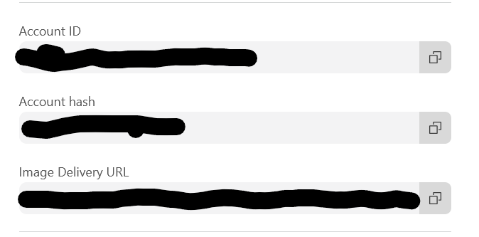

# How to Install

## Method 1: On Docker

Since Ghost 6.0, the recommended (though preview) way to install Ghost is through Docker. As such, this is the way I have mostly tested this adapter. These installation steps are based off of the instructions/setup provided here: [Ghost Docker Install Instructions](https://docs.ghost.org/install/docker) .

1. Setup the repo
   1. `git clone https://github.com/idivait/ghost-storage-cloudflare-images.git /opt/ghost/cloudflare-images && cd /opt/ghost/cloudflare-images`
   2. `npm install --omit=dev`
   3. `npm run build`
2. Modify the env file
   1. `cp .env.storage.example /opt/ghost/.env.storage`
   2. `nano /opt/ghost/.env.storage`
   3. Change the values as indicated in the env file. I've included links to find the values in the comments of the file.
   4. Write out (^O), enter, and exit (^X)
3. Move example override file to root of ghost install
   1. `cp compose.example.override.yml /opt/ghost/compose.override.yml && cd /opt/ghost`
4. Force recreate containers
   1. `docker compose down && docker compose up -d --force-recreate`

## Method 2: Ghost CLI Install

Following an install that used the guide here: [Official Ghost Install Guide](https://docs.ghost.org/install/ubuntu)

1. Setup the repo
   1. Go to the base directory you installed Ghost in (eg. /var/www/ghost)
   2. `git clone https://github.com/idivait/ghost-storage-cloudflare-images.git ./cloudflare-images && cd ./cloudflare-images`
   3. `npm install --omit=dev`
   4. `npm run build`
2. Create a symlink to the storage adapter directory in your content directory
   1. `cd .. && mkdir -p ./content/adapters/storage && ln -s ../../../cloudflare-images ./content/adapters/storage/cloudflare-images`
3. Setup your config (can also be done by modifying the config.production.json file directly)
   1. Create an api token at [Cloudflare API Token Dashboard](https://dash.cloudflare.com/profile/api-tokens) using the 'Read and write to Cloudflare Stream and Images' template
      1. `ghost config storage.cloudflare-images.apiToken YOUR_TOKEN_HERE`
   2. Look up your account id and hash on your [Cloudflare dashboard](https://dash.cloudflare.com/). Select 'Images' in the left hand panel, you should see copyable values in the right hand panel.
      1. 
      2. `ghost config storage.cloudflare-images.accountId YOUR_ACCOUNT_ID_HERE`
      3. `ghost config storage.cloudflare-images.accountHash YOUR_ACCOUNT_HASH_HERE`
   3. Enable the adapter
      1. `ghost config storage.active cloudflare-images`
4. Restart ghost
   1. `ghost restart`

## Other Notes

- Though the delete function is implemented, currently Ghost never deletes images in their storage. This is an issue on Ghost's end (I'm working on implementing some additional tooling to keep those in sync).
- I created a Docker compose file for local development and testing. I currently run it in Github Codespaces using the .devcontainer in the repo.
